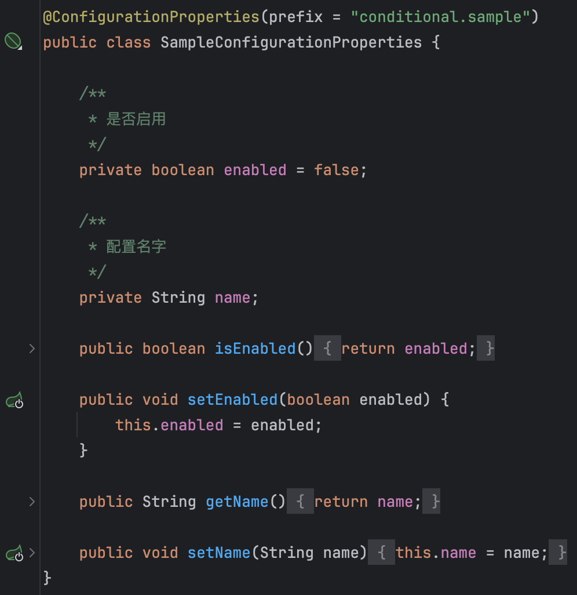
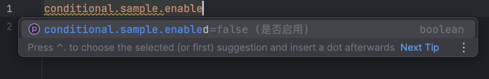

# Spring Boot Conditional Demo

一个扩展Spring Boot条件注解的demo，其功能类似``@ConditionalOnProperty``，都是为了在满足条件时才加载Bean。

# 场景

在Spring Boot中，我们可以通过``@ConditionalOnProperty``注解来控制Bean的加载，
但只使用`@ConditionalOnProperty`时，`spring-boot-configuration-processor`并不会帮助我们生成对应的配置项提示，对开发者并不友好；
其次是，当构造一个对应的`@ConfigurationProperties`的配置类后可生成配置项提示时，其`enalbed`
默认值却并不会与`@ConditionalOnProperty`
的`matchIfMissing`行为保持一致，导致默认值出现歧义且维护麻烦。

为了减少维护成本，本demo实现了一个`@ConditionalOnPropertiesEnabled`，当指定的配置类`enabled`为`true`
时才加载bean。
当修改该配置类的默认值时，`spring-boot-configuration-processor`也能够帮助我们更新配置项提示，
而不必修改`@ConditionalOnProperty`中的`matchIfMissing`，对开发者更友好。
如下图所示，配置类中声明了enabled默认值为false。

那么在IDEA的配置提示中也能够提示默认值为false。

# 实现原理

`@ConditionalOnPropertiesEnabled`的实现原理是通过实现`Condition`接口，在条件匹配期间获取当前的环境变量，并将该环境变量与指定的配置类进行绑定，
最终取出该配置类的`enabled`属性值并返回。